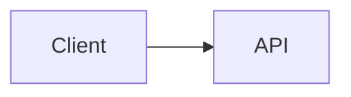

# Editing content

How to change what the site says, without hunting through components.

## The rule

**Edit `src/data/`. Not components.** Two exceptions, both listed below.

## What is shared between the two views

The site has two front ends — the terminal and the GUI portfolio. Most content
feeds both from one file, but not all of it.

| Section | Terminal reads | GUI reads | Shared? |
|---|---|---|---|
| Projects | `src/data/projects.json` | `src/data/projects.json` | yes |
| Experience | `src/data/experience.json` | `src/data/experience.json` | yes |
| Contact | `src/data/contact.js` | `src/components/portfolio/PortfolioFooter.js` | no |
| **About** | `src/data/about.js` | `src/components/portfolio/PortfolioHero.js` | **no** |

`src/lib/filesystem.js` is what turns the shared JSON into the terminal's fake
filesystem, which is why one edit updates both views.

## Projects — one file, plus an optional case study

`src/data/projects.json`, one object per project:

```json
{
  "slug": "nala",
  "title": "Nala",
  "description": "One-liner shown in the GUI card and the terminal README.",
  "longDescription": "Long text, rendered as the Overview section on both views.",
  "tags": ["Python", "RAG"],
  "github": "https://github.com/...",
  "live": null,
  "thumbnail": null,
  "featured": true,

  "context": {
    "company": "Where it was built",
    "team": "Team size and composition",
    "role": "Your scope on it",
    "timeline": "When"
  },
  "problem": "What was broken.",
  "solution": "The approach taken.",
  "impact": ["Result bullet", "Another result"]
}
```

- `title` and `description` appear in both views
- `featured: true` renders a `*` next to it
- `slug` is both the terminal path (`cd projects/<slug>`) and the web route
  (`/projects/<slug>`)
- `thumbnail` is a path under `public/images/projects/`. Leave it `null` and the
  card falls back to a generated initials tile, so a missing image never looks
  broken
- `context`, `problem`, `solution` and `impact` are all **optional** — a project
  missing them just renders fewer sections
- Any value starting with `TODO` renders greyed and italic, so unfilled fields are
  visibly unfinished rather than quietly wrong
- **`github` is no longer a link on the index.** The card links to the case study;
  GitHub lives on that page

### The long-form case study

`src/content/projects/<slug>.md` — optional, one per project, no frontmatter
required. It renders below the structured sections on `/projects/<slug>`.

This is where the technical depth goes: data architecture, schemas, build process,
results. Fenced blocks tagged `mermaid` render as diagrams:

````md

````

`src/content/projects/nala.md` has a flowchart and
`src/content/projects/roblox-studio-mcp.md` a sequence diagram, if you want
working examples to copy.

**Terminal caveat:** the markdown case study is **web only**. `src/lib/filesystem.js`
is imported by the client `Terminal` and so cannot read from disk — the terminal
README shows the structured JSON fields, not this file.

## Experience — one file

`src/data/experience.json`, keys: `role`, `company`, `location`, `startDate`,
`endDate`, `description`, `tags`. Omit `endDate` to render "Present".

**Trap:** `src/lib/filesystem.js` holds an `EXPERIENCE_SLUGS` map keyed by the exact
`role` string. Rename a role in the JSON and its terminal path silently changes to
an auto-generated slug. Update the map at the same time.

## About — two files, keep them in sync

There is no single source for the About text.

1. `src/data/about.js` — plain text, drives `cat about.txt` in the terminal
2. `src/components/portfolio/PortfolioHero.js` — JSX, drives the GUI

The GUI version is JSX because it carries inline links (USF, Nala, Fastly) that
plain text can't express. Changing one and not the other is the most likely way for
this site to start contradicting itself.

In `PortfolioHero.js`: the `<h1>` is the title, the `<p>` blocks are the body.

## The left rail

Not its own component — it's the `<aside>` inside
`src/components/portfolio/PortfolioView.js`, rendered from an array at the top of
that file:

```js
const TABS = [
  { id: "about", label: "About" },
  { id: "projects", label: "Projects" },
  { id: "experience", label: "Experience" },
];
```

`PortfolioNav.js` is a different thing — the top bar with the name, theme toggle,
and terminal button.

### Adding a tab

1. Create `src/components/portfolio/Portfolio<Name>.js` exporting a `<section>`
2. Add `{ id: "<id>", label: "<Label>" }` to `TABS`
3. Add `{tab === "<id>" && <Portfolio<Name> />}` alongside the others, and import it

The rail renders from `TABS`, so the button appears on its own. Nothing else to wire.

This adds the tab to the **GUI only**. To give it a terminal equivalent, add a node
in `buildFileSystem()` in `src/lib/filesystem.js`.

## Adding a terminal command

Different system. `src/lib/commands/<name>.js`, then register it in the `commands`
object in `src/lib/commands/index.js` — that object also drives tab completion.
Handlers return `{ output, newCwd?, action?, actionData? }`. Names starting with `/`
are the auth-gated ones.
