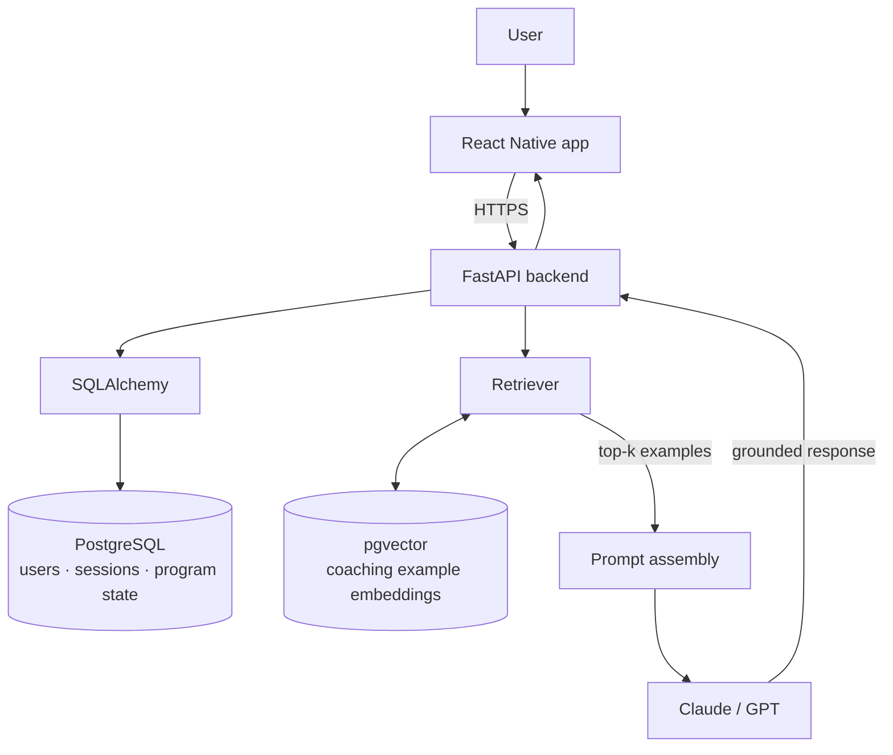

## Data architecture

The system is three layers, and the interesting one is the middle. A request does
not go straight from the app to the model — it goes through a retrieval step that
pulls real coaching examples out of a vector store and puts them in front of the
model before it writes anything.

Relational state and vector state live in the same PostgreSQL instance —
`pgvector` is an extension, not a separate service — so a retrieval and the
program-state read it is conditioned on happen against one database.

TODO: the actual table shapes. Worth showing the conversation, program-week, and
embedding tables, and how a retrieval is scoped to where the user is in the
4-week program.

## Implementation notes

TODO: the decisions that were not obvious. Candidates worth writing up —

- how coaching examples were chunked and embedded, and what the top-k is
- what happens when retrieval returns nothing relevant
- how the 4-week program state constrains what the model is allowed to suggest
- why the provider is swappable between Claude and GPT, and whether the retrieval
  quality holds across both

## Results

TODO: this is the section that will carry the most weight for a reader. The
publication is submitted — once there are numbers in it, they belong here.

## Process

TODO: build-process shots next to the finished product. Drop screenshots in
`public/images/projects/` and reference them here as ``.
