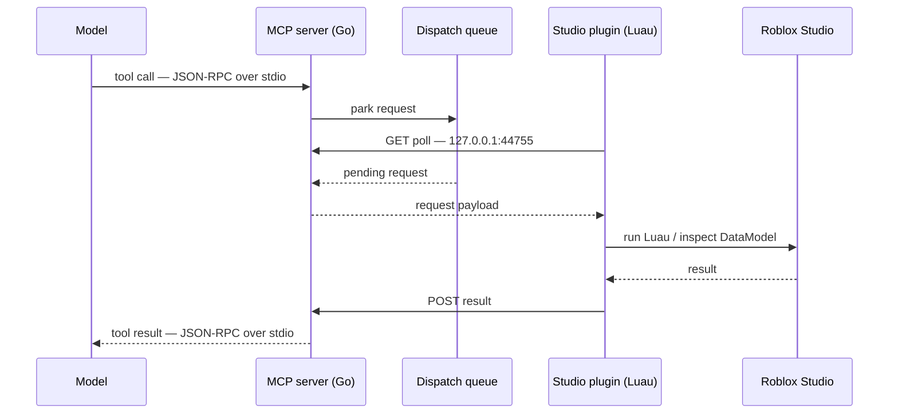

## The transport problem

Roblox Studio plugins cannot accept inbound connections. That single constraint
decides the whole architecture: there is no socket for an MCP server to dial, so
the server cannot push a tool call into Studio.

The fix is to invert who initiates. The plugin polls; the server answers. A tool
call arriving over stdio parks in a dispatch queue until the plugin's next poll
comes to collect it.

Two consequences fall out of this shape. Latency is bounded below by the poll
interval, not by the work itself. And because the MCP side speaks JSON-RPC over
stdio, stdout belongs entirely to the protocol — every log line goes to stderr,
or the transport corrupts.

## Implementation notes

TODO: worth writing up —

- the poll interval, and how long a call is allowed to park before it times out
- what happens to a queued call when Studio closes mid-flight
- how Luau execution errors are marshalled back as tool errors rather than
  transport failures
- which tools are exposed, and how the DataModel is serialized for inspection

## Results

TODO: what this actually unlocked — tasks completed end-to-end, tools exposed,
anything you measured.

## Process

TODO: a screen recording still or before/after of the model editing a live place
would carry this section. Drop images in `public/images/projects/`.
